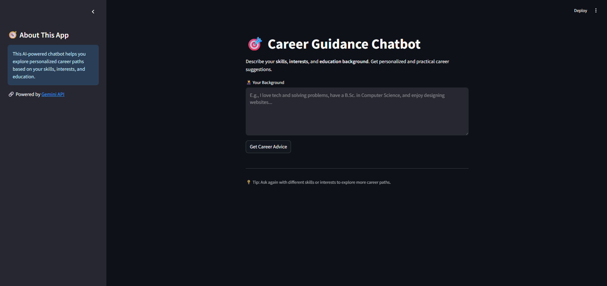

#  Career Guidance Chatbot – Personalized AI Career Suggestions Using Gemini API


## 🚀 Overview

**Career Guidance Chatbot** is a Generative AI-powered [Streamlit](https://streamlit.io/) web app developed during the **GenAI Foundation Program**. It helps users explore personalized, future-ready career options based on their **skills, interests, and education background** using Google’s **Gemini 2.0 Flash API**. Ideal for students, professionals, or anyone exploring new career paths.

## ✨ Key Features

- **AI-Powered Career Advice** – Tailored suggestions generated by Gemini based on user input.
- **Bold Titles with Rich Descriptions** – Clear, insightful summaries for each career.
- **Clickable Resource Links** – Explore careers further with trusted sources.
- **Session History** – Review your past queries and AI responses.
- **Secure API Key Handling** – Supports both `.env` (local) and `secrets.toml` (Streamlit Cloud or self-hosted).
- **Modern, Clean UI** – Streamlit-based layout with responsive design.

## 📌 How It Works

1. The user inputs their skills, interests, and educational background.
2. The app constructs a well-formatted prompt and sends it to the Gemini API.
3. Gemini returns 3 career suggestions, each with a title, explanation, and link.
4. The user views suggestions in an intuitive and readable layout.
5. Previous queries and results are saved in session history for review.

## 📌 Use Cases

- **Students:** Discover career paths aligned with academic background.
- **Professionals:** Explore career shifts or upskilling opportunities.
- **Career Counselors:** Use as a supportive tool for client consultations.

## 📸 Screenshot



## 🖥️ Setup Instructions

1. Clone the repository:
   ```sh
   git clone https://github.com/jeevandeepsaini/CareerGuidanceChatBot.git
   cd CareerGuidanceChatBot
   ```
2. Create and activate a virtual environment:
   ```sh
    python -m venv .venv
    .venv\Scripts\activate  # On Windows
    # or
    source .venv/bin/activate  # On macOS/Linux
   ```
3. Install dependencies:
    ```sh
    pip install python-dotenv streamlit requests
    #or
    pip install -r requirements.txt
    ```
4. Add your Gemini API key securely:
   - For local development, create a `.env` file in the project root:
     ```sh
     GEMINI_API_KEY=your_gemini_key_here
     ```
   - For Streamlit Cloud deployment, add your key via:
     - App Settings → Secrets:
       ```sh
       GEMINI_API_KEY = "your_gemini_key_here"
       ```
     - Or by creating `.streamlit/secrets.toml` locally with:
       ```sh
       GEMINI_API_KEY = "your_gemini_key_here"
       ```
5. Run the app:
   ```sh
   streamlit run careerBot.py
   ```
6. Open your browser to the provided `localhost` link to start using the chatbot
   
## 🛠️ Tech Stack

- **Language:** Python
- **Framework:** Streamlit
- **API:** Google Gemini 2.0 Flash (generateContent)
- **Tools:** PyCharm, virtualenv

## 🛡️ Security & Privacy

- No user data is stored or transmitted beyond the Gemini request.
- Supports both .env and secrets.toml for secure API key management.
- Ideal for local or internal educational/counseling use.

## ⚠️ API Usage & Deployment Disclaimer

This app uses Google's Gemini API, which is currently free with usage limits. The publicly deployed Streamlit app is provided **strictly for demonstration purposes**.

Please note:
- The API quota may be exceeded with high usage, after which the app may stop functioning temporarily.
- This app is not intended for continuous or personal use without setting up your own API key.
- If you're cloning or forking this project, make sure to add your own Gemini API key in the `.env` file or `secrets.toml`.

I appreciate your understanding and responsible usage of this demo!

## 📝 License

This project is licensed under the **MIT License** – feel free to use and modify it.

## 🔎 Additional Notes

This project integrates with the [Gemini API (Google Generative Language API)](https://ai.google.com/). To use this software, you must obtain your own API key and ensure compliance with [Google’s API usage terms](https://ai.google.dev/gemini-api/terms). API keys are not included in this repository for security reasons.
